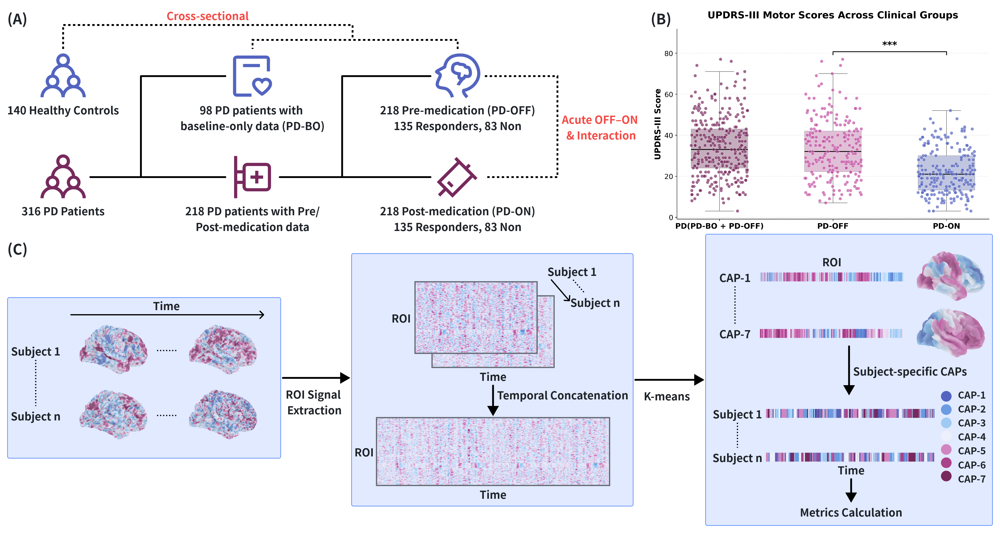
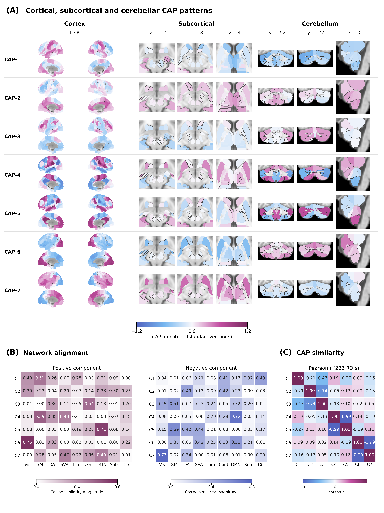
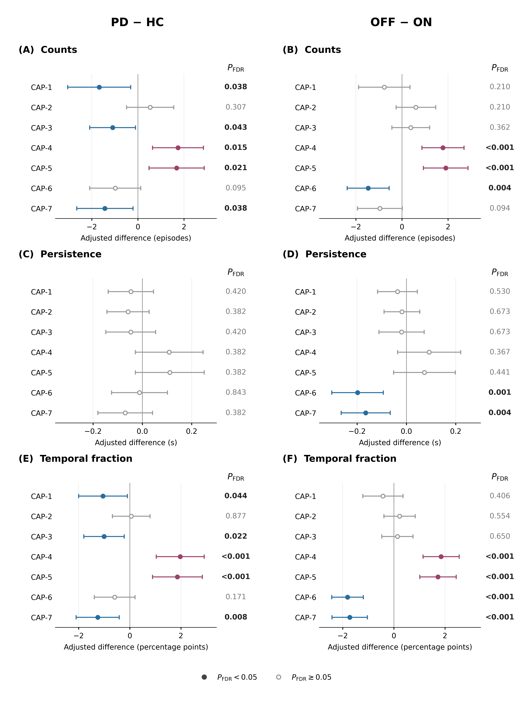
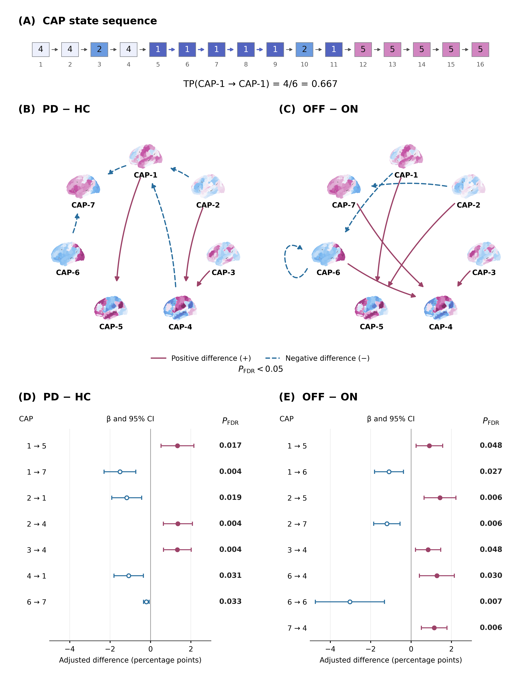
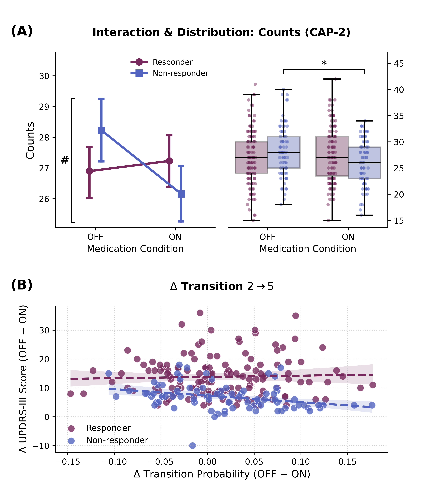

# PD NeuroCAPs — Whole-brain co-activation dynamics in Parkinson’s disease

Analysis code and results accompanying the manuscript:

> **Whole-brain co-activation dynamics and acute motor responsiveness during levodopa challenge in Parkinson’s disease**

This repository examines resting-state fMRI co-activation patterns (CAPs), baseline differences between Parkinson’s disease (PD) and healthy controls (HC), acute OFF–ON differences, and their association with motor responsiveness. The analysis and figures reflect the revised manuscript dated September 9, 2026 (`manuscript-cap-20260909-02`).

## Study and principal findings

The retained sample comprises **140 HC and 316 participants with PD**: 98 with baseline-only OFF-medication data and 218 with paired OFF and ON scans. All **674 scan sessions** contributed to a shared **seven-CAP solution** using a 283-ROI atlas. Each retained scan contains **480 consecutive frames** (TR = 0.735 s).



Baseline scans in both PD cohorts followed at least 12 h of antiparkinsonian medication withdrawal. The acute challenge used 150% of each participant’s usual morning antiparkinsonian medication dose; 200/50 mg denotes the levodopa/benserazide formulation strength. ON scans were acquired approximately 60 minutes after administration. Improvement of at least 30% in MDS-UPDRS-III defined acute responders (135 responders; 83 non-responders). Two participants with exactly 30% improvement were included among responders.

| Comparison | Principal results |
|---|---|
| PD baseline − HC | Lower counts and temporal fractions for CAP-1/3/7; higher values for CAP-4/5. No persistence difference survived FDR correction. Seven directed transition probabilities differed. |
| Paired OFF − ON | ON counts were lower for CAP-4/5 and higher for CAP-6. ON temporal fractions were lower for CAP-4/5 and higher for CAP-6/7; persistence was higher for CAP-6/7. Eight directed probabilities differed. Global transition frequency was not significant. |
| Condition × Response | CAP-2 counts showed an interaction: β = −2.424 episodes, 95% CI −4.162 to −0.687, *P*<sub>FDR</sub> = 0.0438 within the seven-state counts family. No interaction survived correction in the other metric families. |
| CAP-2 simple effects | OFF−ON = 2.111 episodes in non-responders (*P*<sub>FDR</sub> = 0.0178); −0.313 in responders (*P*<sub>FDR</sub> = 0.6620). |

These findings concern **acute motor responsiveness**. OFF always preceded ON, so medication and scan-order effects cannot be fully separated. The non-responder CAP-2→CAP-5 correlation is exploratory: it survived correction only in that subgroup, which was itself defined using motor improvement. Sex-stratified interaction tests did not survive correction.

## Analysis workflow

1. Calculate run-level FD and clinical summaries. Retain runs with mean FD <0.5 mm and >98% of frames below 1.0 mm; exclude both challenge scans if either fails QC.
2. Load or extract regional time series from preprocessed BIDS data and apply the paired QC selection.
3. Fit pooled K-means++ for k = 2–20 (`random_state=0`, `n_init=1000`, `max_iter=500`); select k = 7 using the elbow criterion. Assess pooled-frame resampling stability with 1,000 bootstrap resamples.
4. Export CAP templates, framewise assignments, counts, persistence, temporal fraction, transition frequency and directed transition probabilities.
5. Prepare baseline and paired statistical datasets; fit ANCOVA, mixed models, response interactions, sex sensitivity models and exploratory partial Spearman correlations.

The manuscript preprocessing discarded the first 10 of 490 acquired volumes uniformly. Retained time series have no additional frame censoring or interpolation. Prepare input images and confounds consistently with this preprocessing; the notebook does not rerun fMRIPrep or the full image-preprocessing workflow.

The atlas contains **210 cortical, 42 subcortical and 31 cerebellar ROIs**, combining Brainnetome, CIT168-derived subcortical parcels and SUIT-derived cerebellar parcels. Legacy filenames retain `BN234_CIT18_SUIT34`; the final atlas has 283 ROIs. Centroid amplitudes and network cosine similarities are descriptive spatial quantities.



### Statistical models

| Analysis | Implementation |
|---|---|
| Baseline PD − HC ANCOVA | `scripts/statistics_ancova_lmm_utils.py` |
| Acute paired OFF − ON random-intercept LMM | `scripts/statistics_ancova_lmm_utils.py` |
| Condition × Response interaction and simple effects | `scripts/response_lmm_interaction_utils.py` |
| Condition × Response × Sex and sex-stratified models | `scripts/response_llm_stratified_utils.py` |
| Partial Spearman correlations | `scripts/statistics_correlation_utils.py` |

Imaging models adjust for sex, age, education and mean FD; paired models use scan-specific FD. The response interaction is `(OFF−ON in responders) − (OFF−ON in non-responders)`. Paired correlations use OFF−ON changes and adjust for demographics and ΔFD.

Benjamini–Hochberg FDR is applied **separately within each metric family and comparison/contrast or correlation cohort**: counts (7), persistence (7), temporal fraction (7), transition probability (49, including self-transitions), and transition frequency (1). These are family-specific values, not a single correction across all 71 measures. Confidence intervals and clinical comparison P values are unadjusted. Pooled-frame bootstrap stability is a within-dataset assessment, not independent participant-level validation.







## Environment and execution

The source analysis environment uses **Python 3.14.3** and **NeuroCAPs 0.37.4**. [`requirements.txt`](requirements.txt) records the installed versions of directly used packages; these versions describe the analysis environment, not tested minimum requirements.

```bash
python -m pip install -r requirements.txt
# Optional browser interface (or open the notebook in an existing notebook editor):
python -m pip install jupyterlab
python -m jupyterlab PDNeuroCAPs.ipynb
```

Run from the repository root and select the environment containing the dependencies. The notebook is synchronized unchanged from the current analysis project, including its saved outputs. Its cells run in order from QC through sex sensitivity analysis. The retained `svm_response_prediction_utils.py` is a legacy utility and is not invoked by this notebook or used for the revised manuscript. Continuous-response analysis is outside this snapshot.

Required local inputs are:

- `data/merged_clinical_metrics.csv`: clinical and demographic fields used by the analysis.
- `data/atlas/`: the atlas image and ROI mapping, plus `atlas283_custom_parcellation.py`.
- `data/confound_rename/`: per-scan confound TSV files used by the first QC cell.
- `MyDataSet_Reorganized/`: preprocessed BIDS images for extraction when the cached time series are unavailable.

The notebook loads `outputs/PDNeuroCAPs/01_extraction/subject_timeseries.pkl` and `02_clustering/cap_analysis.pkl` when present. Use caches from the same analysis snapshot. To refit after changing inputs or clustering parameters, move the affected caches to a separate backup first. A Git checkout omits the extraction cache and pickle models; full recomputation therefore requires access to the imaging inputs. The local synchronized project includes those result caches and the confound inputs.

The QC and clinical steps can also be run directly:

```bash
python scripts/FD_statistics.py
python scripts/clinical_statistics_LEDD.py
```

Root-level versions of these two entry points forward to `scripts/` for compatibility.

## Results and repository layout

| Path | Contents |
|---|---|
| `PDNeuroCAPs.ipynb` | Main analysis notebook |
| `scripts/` | QC, clinical, CAP-export and statistical utilities |
| `figure/` | Selected manuscript Figures 1–5 displayed above |
| `figurePlotScripts/` | Current plotting code, captions, source-data exports and rendered figures |
| `outputs/PDNeuroCAPs/01_extraction/` | Cached extracted time series and CSV/NPZ exports; local only |
| `outputs/PDNeuroCAPs/02_clustering/` | Elbow scores, bootstrap summaries and cached CAP model |
| `outputs/PDNeuroCAPs/03_metrics/` | CAP metric tables |
| `outputs/PDNeuroCAPs/04_framewise_labels/` | Per-scan state assignments |
| `outputs/PDNeuroCAPs/05_cap_templates/` | CAP centroid and network-profile tables |
| `outputs/PDNeuroCAPs/06_statistics_datasets/` | Merged baseline and paired datasets |
| `outputs/PDNeuroCAPs/07_statistics_ANCOVA_LMM/` | ANCOVA and paired LMM results |
| `outputs/PDNeuroCAPs/08_statistics_correlation/` | Complete exploratory correlation results |
| `outputs/PDNeuroCAPs/09_response_lmm_interaction/` | Response interaction and simple effects |
| `outputs/PDNeuroCAPs/10_response_lmm_stratified/` | Three-way interaction and sex-stratified results |
| `outputs/clinical_statistics/` | Run-level FD/QC decisions and clinical summaries |

Internal filenames such as `03_longitudinal_paired_wide.csv` are retained for code compatibility; the associated comparison is an acute same-day OFF–ON challenge. Old SVM outputs, continuous-response outputs and `HistoricalData` are excluded from the current result snapshot.

## Figure reproduction

The selected outputs comprise **five main figures and seven supplementary figures**. The [figure manifest](figurePlotScripts/FIGURE_MANIFEST_AND_REVISION_SUMMARY.md) maps each selected image to its caption and generating code. Older alternative renderings may remain in the source export folders; use the manifest to identify the manuscript versions.

```bash
python figurePlotScripts/01_elbow_plot.py
python figurePlotScripts/02_Figure2.py
python figurePlotScripts/03_Figure3.py
python figurePlotScripts/04_Figure4.py
python figurePlotScripts/05_Figure5.py
python figurePlotScripts/05_Figure5_gender.py
```

These scripts read the synchronized results. Surface plotting may need locally cached or downloaded reference surfaces. Figure 4 uses the surface assets generated by Figure 2, so run them in that order. Figure 1 is an author-assembled image; the `01_*` scripts generate its constituent panels, not its complete final layout. Supplementary S1 is redrawn from saved elbow scores without refitting clustering.

## Data access and citation

Raw MRI images are not included. The local snapshot includes extraction results, model caches and confounds; `.gitignore` excludes these from new Git additions. Versioned result tables and selected figure-source exports include participant-level derived measures as well as aggregate statistics. Access to raw images and restricted inputs should be requested from the corresponding authors, Tao Feng or Tao Liu.

Please cite the manuscript above when using this work. Journal citation details and a DOI will be added after publication. The repository currently has no separate license file; contact the corresponding authors for questions about reuse.
